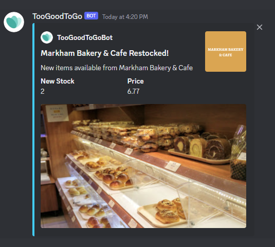

# TooGoodToGoBot
Too Good To Go is an app that looks to solve food waste by providing a platform to connect restaurants with excess food and consumers looking for great deals. I use the app frequently looking for deals on tasty food items that I would probably purchase at full price anyways. There's one feature the app is missing though; notifications.

TooGoodToGoBot is my solution to this feature via a service run fully on AWS that integrates with Discord bot APIs to send discord notifications upon store restocks. Note that TooGoodToGoBot is unaffiliated with Too Good To Go and any usage is done so at your own risk.

## Setup
In the future, I may plan to create a centralized bot that can be added directly to servers to subscribe specific accounts, but in the meantime it is possible to completely setup this service for your own use.

### Installation
Dependencies: Node.js 
```
git clone https://github.com/jackie-z528/TooGoodToGoBot.git
cd TooGoodToGoBot
npm i
```
### Discord Bot
Create a [discord application](https://discord.com/developers/applications) and a discord bot under the application. Make a note of the bot token somewhere.
### AWS Setup
Create an AWS account, note that a credit card is required, but as long as this service is used correctly, your account will remain under the free tier limits for DynamoDB and Lambda by a huge margin.

### Serverless Setup
* Create a [serverless dashboard](https://app.serverless.com) account
* Create a new app `too-good-to-go-bot`
* Create a new service `too-good-to-go-bot` under the app `too-good-to-go-bot`
* Go into the settings of `too-good-to-go-bot` service and add 3 paramaters:
    * discordToken: token for your discord bot
    * tableName: name you want for the DynamoDB table
    * awsRegion: probably `us-east-1`
* Modify the first line of serverless.yml `org: <orgname>` to the orgname of your serverless account
* Run `serverless` in the project directory and follow the steps to setup the AWS services

### Login
After the AWS Lambdas are deployed, you should see output in the console with the login endpoint. Run the login command by sending a post request to `<loginendpoint>/login/:email` and wait for a login request from Too Good To Go to be sent to your email. Click the login button in the email on a browser. **Do not click it on a phone with Too Good To Go installed, this will not work.** Then send a post request to `<loginendpoint>/login/:email/continue` and wait for `Login Succeeded`. The polling lambda will now run successfully.

### Setting Up Discord Notifications
To enable discord notifications, add the bot you created to a server of your choice. In the server, right click the channel you'd like to receive the notifications in and click `Copy ID`. In the AWS console, add a new item to the dynamoDB with `{ key: "subscribedChannels", valueList: [id]}`.

## Usage
The bot will poll the Too Good To Go API every minute and send a notification to the subscribed channels whenever there is an increase in stock.
